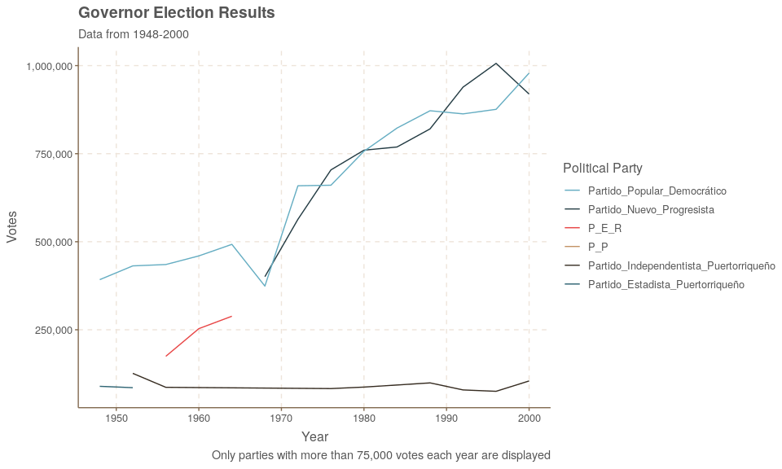
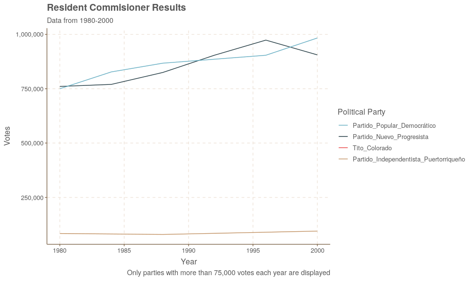
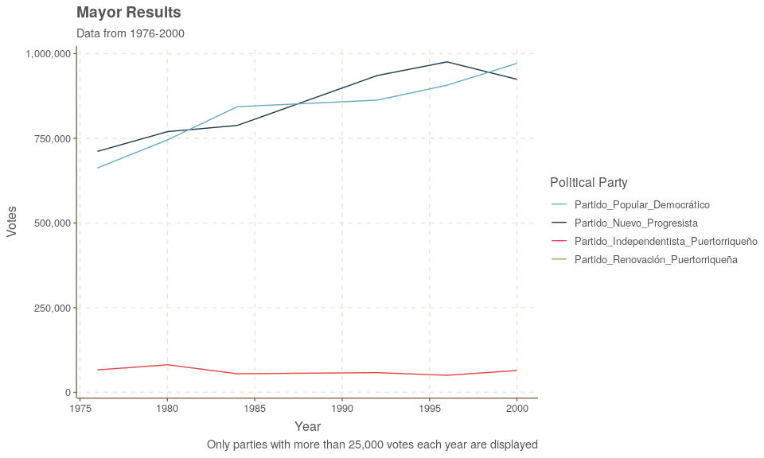

Context
-------

I scraped all the historical data from the Puerto Rico's Electoral Commission webpage to make it accesible in a way that can be combined with Census data, as well as other socio-economic indicators to better explain political patterns in Puerto Rico. In the next month I will add as well the elections of 2004, 2008, 2012, 2016, but with a more granual level than municipalities. I parsed the names of the parties I knew, but the other ones stayed with the code assigned by the CEE, if you know them, and can provide a reference please send me an email at: <iflores.siaca@gmail.com>

> The GitHub repository with all the code for this project is available here: <https://github.com/ian-flores/PR_Elections_Historical_Data>

> Disclaimer: The data contained in this page was pulled from the Puerto Rico's Electoral Commission webpage. Where there to be any discrepancies, please refer to their page.

### Data Available

-   Governor *(1948 - 2000)*
-   Resident Commissioner *(1932 - 1944) & (1980 - 2000)*
-   Mayors *(1976 - 2000)*

### Governor Data Available

> This data is available to download here: [Governor\_CSV](https://github.com/ian-flores/PR_Elections_Historical_Data/blob/master/data/elecciones_generales/gobernador/gobernador.csv)

### Resident Commissioner Data Available

> This data is available to download here: [Commissioner\_CSV](https://github.com/ian-flores/PR_Elections_Historical_Data/blob/master/data/elecciones_generales/comisionado_residente/comisionado_residente.csv)

### Mayors Data Available

> This data is available to download here: [Mayor\_CSV](https://github.com/ian-flores/PR_Elections_Historical_Data/blob/master/data/elecciones_generales/alcalde/alcalde.csv)

